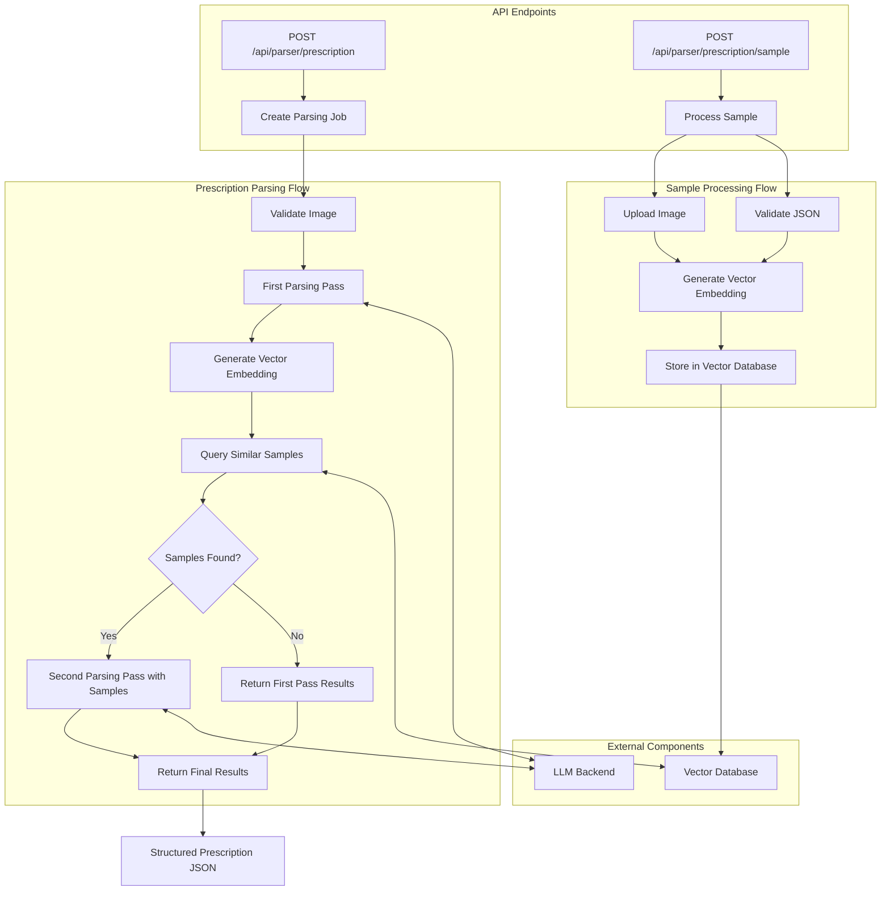

# Prescription Parser

This project is a service for parsing prescription images into standardized JSON responses. It demonstrates AI use cases for healthcare applications using multimodal LLMs. It's meant to serve as a technical demonstration and is not HIPAA-compliant out of the box (Gemini can be HIPAA-compliant with a BAA).

When building real healthcare applications make sure to use HIPAA-compliant LLM models, cloud infrastructure providers, and instrumentation.

## Features

- Extract structured data from prescription image PDFs
- Support for multiple AI backends (OpenAI and Google Gemini)
- Multi-pass processing pipeline for improved accuracy
- Vector similarity search for example-based learning
- Sample prescription storage for continuous improvement

## Components

### Service
The core service is a Go application that exposes REST API endpoints for:
- Parsing prescription images (`POST /api/parser/prescription`)
- Adding sample prescriptions with validated JSON (`POST /api/parser/prescription/sample`) 
- Retrieving job status (`GET /api/parser/prescription/{id}`)

### Vector Database
The project utilizes a PostgreSQL database with the [pgvector](https://github.com/pgvector/pgvector) extension for vector similarity search. This enables the system to find similar prescriptions to improve parsing accuracy.

### LLM Backends
The service supports two LLM providers:

1. **OpenAI GPT-4 Vision** - Using the [openai-go](https://github.com/openai/openai-go) package
2. **Google Gemini** - Using the Google AI Gemini API

Based on testing, Gemini's multimodal capabilities appear to deliver superior results for prescription parsing.

## Multi-Pass Processing Pipeline

The prescription parsing process follows these steps:

1. Initial parsing of the prescription image by the LLM
2. Vector embedding generation for the parsed prescription
3. Similar sample prescription retrieval from the vector database
4. Second parsing pass (review) that includes sample prescriptions as context for improved accuracy
5. Return the final parsed results

## Architecture Diagram

The following diagram illustrates the prescription processing flow, including sample processing and multi-pass parsing:



### Parsing Accuracy
While the multi-pass processing pipeline has been an interesting experiment, thus far the outcome has actually been lower accuracy than the first pass. Running the parser with no sample data loaded yields on average 95% accuracy while the accuracy with three samples loaded is currently ~50%. I want to continue to experiement with tuning the second pass parsing prompt to improve the results.

```
### Zero Samples Loaded
Filename: Humira4.pdf - Job ID: b1d1f903-5429-4d04-ba7f-6b05472d30f8
Score: 95.83% - (69.00 / 72)
Feedback:
The parser demonstrated high accuracy across most fields, achieving exact matches for a significant portion of the data. Minor semantic differences were observed in the 'clinical_info' and 'medications[0].administration_notes' fields, which were scored as semantically equivalent. However, two fields, 'patient.phone_numbers[0].label' and 'prescriber.npi', showed significant discrepancies, and most notably, the 'medications[0].indication' field was completely missed by the parser, resulting in a 0.0 score. Overall, the parser performed very well, but there are clear areas for improvement regarding specific data points and ensuring completeness.
```

```
### Three samples loaded
Filename: Humira4.pdf - Job ID: c4294091-237b-4032-b5ad-234d26de2dd4
Score: 52.78% - (38.00 / 72)
Feedback:
The parser demonstrated moderate performance in extracting prescription details. While it accurately captured basic patient demographic information (DOB, sex, address) and prescriber office details, it struggled significantly with critical fields. Key patient identifiers (first name, last name), prescriber details (name, NPI), date needed, and the entire medications section were either missing or incorrect, leading to a substantial number of zero-point scores. The `clinical_info` and `delivery.destination` fields were also entirely missed. Improvements are needed in reliably extracting core entities and their associated details, especially medication information and patient/prescriber names and identifiers.
```

## Setup and Running

### Prerequisites
- Go 1.21+
- PostgreSQL with pgvector extension
- API keys for OpenAI and/or Google Gemini

### Environment Variables
Create a `.env` file (or set them another way) in the project root with the following variables:

```
# Server Configuration
SERVER_HOST=localhost
SERVER_PORT=8080

# Database Configuration
DB_HOST=localhost
DB_PORT=5432
DB_NAME=prescription_parser
DB_USER=postgres
DB_PASSWORD=your_password

# LLM API Keys
OPENAI_API_KEY=your_openai_key # If using the OpenAI parser backend
GEMINI_API_KEY=your_gemini_key # If using the Gemini parser backend

# Parser Backend (Optional, defaults to OpenAI if OpenAI key is provided, or Gemini if Gemini key is provided)
PARSER_BACKEND=Gemini  # Options: OpenAI, Gemini
```

### Running the Service
1. Install dependencies:
```bash
go mod download
```

2. Start the service:
```bash
go run cmd/prescription-parser/main.go
```

3. Use the `-env` flag to specify a custom env file location:
```bash
go run cmd/prescription-parser/main.go -env /path/to/.env
```

### Sample Images
The `samples` directory contains sample prescription images and their corresponding validated JSON representation.

## API Usage

### Parse a Prescription
```
POST /api/parser/prescription
Content-Type: multipart/form-data

Form-data:
- image: [PDF file]
```

### Add a Sample Prescription
```
POST /api/parser/prescription/sample
Content-Type: multipart/form-data

Form-data:
- image: [PDF file]
- json: [Validated prescription JSON]
```

### Check Job Status
```
GET /api/parser/prescription/{job_id}
```

## Parser Evaluation Utility

The project includes a `parser-eval` utility that evaluates the parser's accuracy by comparing generated output against expected JSON. This is valuable for:

- Testing parser accuracy on known prescription formats
- Validating improvements to the parsing pipeline
- Benchmarking different LLM backends

### Running Parser Evaluation

```bash
go run cmd/parser-eval/main.go -pdf path/to/prescription.pdf -json path/to/expected.json
```

### Command Line Options

- `-env`: Path to environment file (default: `.env`)
- `-pdf`: Path to test PDF file (required)
- `-json`: Path to expected JSON output file (required)
- `-iterations`: Number of times to run the parser (default: 1)

### Evaluation Output

The utility produces detailed scoring information for each parsed field, including:

- Overall percentage score
- Points awarded and total possible points
- Summary critique of parser performance
- Per-field scores with reasoning for each score

Example output:
```
Filename: Humira4.pdf - Job ID: 62da963f-2010-49cc-a0ff-4aa4a6b91c1b
Score: 96.18% - (69.25 / 72)
Feedback:
The parser achieved a very high overall score, indicating strong accuracy and completeness. Most fields were extracted perfectly. Minor errors were observed in the patient's phone number label, prescriber's NPI, and prescriber's office fax number, which were significantly different. There were also two instances of semantically equivalent variations in 'clinical_info' and 'medications[0].administration_notes', which suggests minor variations in phrasing rather than significant data extraction errors.
```

### Scoring Methodology

Fields are scored on a scale from 0.0 to 1.0:
- 1.0: Exact match
- 0.75: Semantically equivalent (e.g., abbreviations)
- 0.25: Partial match
- 0.0: Missing or incorrect

The overall percentage is calculated as (total awarded points / total possible points) * 100.


