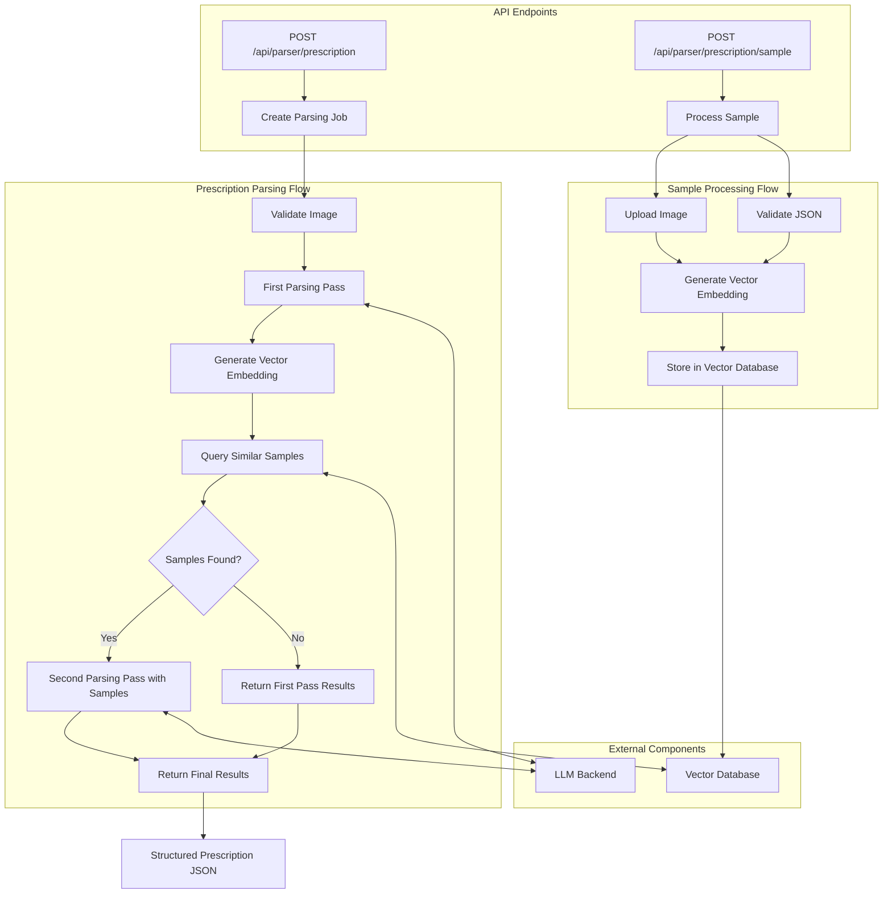

# Prescription Parser

This project is a service for parsing prescription images into standardized JSON responses. It demonstrates AI use cases for healthcare applications using multimodal LLMs. It's meant to serve as a technical demonstration and is not HIPAA-compliant out of the box (Gemini can be HIPAA-compliant with a BAA).

When building real healthcare applications make sure to use HIPAA-compliant LLM models, cloud infrastructure providers, and instrumentation.

## Features

- Extract structured data from prescription image PDFs
- Support for multiple AI backends (OpenAI and Google Gemini)
- Multi-pass processing pipeline for improved accuracy
- Vector similarity search for example-based learning
- Sample prescription storage for continuous improvement

## Components

### Service
The core service is a Go application that exposes REST API endpoints for:
- Parsing prescription images (`POST /api/parser/prescription`)
- Adding sample prescriptions with validated JSON (`POST /api/parser/prescription/sample`) 
- Retrieving job status (`GET /api/parser/prescription/{id}`)

### Vector Database
The project utilizes a PostgreSQL database with the [pgvector](https://github.com/pgvector/pgvector) extension for vector similarity search. This enables the system to find similar prescriptions to improve parsing accuracy.

### LLM Backends
The service supports two LLM providers:

1. **OpenAI GPT-4 Vision** - Using the [openai-go](https://github.com/openai/openai-go) package
2. **Google Gemini** - Using the Google AI Gemini API

Based on testing, Gemini's multimodal capabilities appear to deliver superior results for prescription parsing.

## Multi-Pass Processing Pipeline

The prescription parsing process follows these steps:

1. Initial parsing of the prescription image by the LLM
2. Vector embedding generation for the parsed prescription
3. Similar sample prescription retrieval from the vector database
4. Second parsing pass (review) that includes sample prescriptions as context for improved accuracy
5. Return the final parsed results

## Architecture Diagram

The following diagram illustrates the prescription processing flow, including sample processing and multi-pass parsing:



## Setup and Running

### Prerequisites
- Go 1.21+
- PostgreSQL with pgvector extension
- API keys for OpenAI and/or Google Gemini

### Environment Variables
Create a `.env` file (or set them another way) in the project root with the following variables:

```
# Server Configuration
SERVER_HOST=localhost
SERVER_PORT=8080

# Database Configuration
DB_HOST=localhost
DB_PORT=5432
DB_NAME=prescription_parser
DB_USER=postgres
DB_PASSWORD=your_password

# LLM API Keys
OPENAI_API_KEY=your_openai_key # If using the OpenAI parser backend
GEMINI_API_KEY=your_gemini_key # If using the Gemini parser backend

# Parser Backend (Optional, defaults to OpenAI if OpenAI key is provided, or Gemini if Gemini key is provided)
PARSER_BACKEND=Gemini  # Options: OpenAI, Gemini
```

### Running the Service
1. Install dependencies:
```bash
go mod download
```

2. Start the service:
```bash
go run cmd/prescription-parser/main.go
```

3. Use the `-env` flag to specify a custom env file location:
```bash
go run cmd/prescription-parser/main.go -env /path/to/.env
```

### Sample Images
The `samples` directory contains sample prescription images and their corresponding validated JSON representation.

## API Usage

### Parse a Prescription
```
POST /api/parser/prescription
Content-Type: multipart/form-data

Form-data:
- image: [PDF file]
```

### Add a Sample Prescription
```
POST /api/parser/prescription/sample
Content-Type: multipart/form-data

Form-data:
- image: [PDF file]
- json: [Validated prescription JSON]
```

### Check Job Status
```
GET /api/parser/prescription/{job_id}
```

## Continuous Improvement

The system learns from sample prescriptions stored in the vector database. When adding a new sample prescription, the system:

1. Uploads the prescription image
2. Generates vector embeddings for the provided JSON
3. Stores both in the database

These samples are later used during the parsing process to improve accuracy, especially for prescriptions with similar formats or structures.
